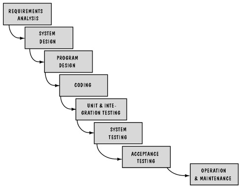

# Chapter 2:Modeling the Process and Life Cycle

## 1.什么是软件过程，软件过程的重要性？

- 定义：软件开发过程中的各种组织及规范方法。
- 重要性：它使一组活动具有了一致性和结构，是程序的集合组合起来已经产生满足目标和标准的产品，过程结构用于检查、理解、控制和改变组成过程的活动来指导我们的行为，它能使我们获取经验并把它传授给别人。

## 2.瀑布模型及其文档、优缺点                

- 特点：阶段之间的线性关系/瀑布特征、以交付物作为活动结束的里程碑
- 优点
  - 用里程碑和各个阶段的提交文档描述开发过程
  - 它的简明性使得人们能够容易向软件开发的顾客清楚的做出解释
  - 其他模型的基础
- 缺点：
  - 面临变动时，该模型无法处理实际过程中的重复开发的问题
  - 文档转换有困难

## 3.原型

- 定义：一部分开发的产品，用来让用户和开发者共同研究，提出意见，为最终产品定型。

## 4.分阶段开发模型的含义、分类和特点

- 含义：系统被设计成部分提交，每次用户只能得到部分功能，而其他部分处在开发过程中。
- 分类：
  - 增量式开发：系统需求按照功能分成若干子系统，开始建造的版本是规模小的，部分功能的系统，后续版本添加包含新功能的子系统，最后版本是包含全部功能的子系统集。
  - 迭代式开发：系统开始就提供了整体的功能框架，后续版本陆续增强各个子系统，最后使各个子系统的功能达到最强。
- 特点：
  - 培训过程可以很早开始，可以使得开发人员观察用户的反映，为后续版本提供更好的建议。
  - 可以为那些以前从未实现的功能提前开发市场。
  - 不断发布新的版本使得开发人员可以快速的修正系统中的问题。
  - 不同的开发版本可以针对不同的专业领域

## 5.螺旋模型的四个象限的任务以及四重循环的含义，每层起始和含义

- 任务：
  - 计划
  - 目标/可选方案
  - 风险评估
  - 开发和测试
- 四重循环：
  - 操作概念
  - 软件需求
  - 软件设计
  - 系统测试

## 6.敏捷方法（重点）

- 定义：总体目标是通过“尽可能早地对所有价值软件的交付”使客户满意。通过在软件开发过程中加入灵活性，敏捷方法可以使用用户能够在开发周期和后期增加或改变需求。

## 7.极限编程（XP）

- 定义：是激发开发人员创造性，是管理负担最小的一组技术。
- 敏捷方法的四个特性
  - 交流
  - 简单性
  - 勇气
  - 反馈

## 8.在所有的软件开发模型中，你认为那些过程给予你最大的灵活性以应对需求的变更

**阶段开发模型**和**螺旋模型**